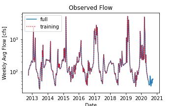
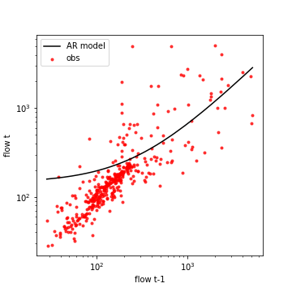
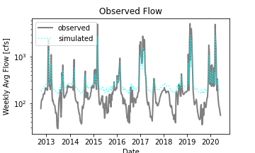

## Scott Schulze, 10/4/2020, Homework #6

Welcome to the land of confusion, despair, and disgust acting as a repository for this assignment.

1.  I attempted several modifications to the model to make it more useful and/or successful, and failed at nearly all of them. I attempted to make and utilize my own low-flow training set. I did end up narrowing the window down to about 3/4 through the dataset, this was chosen generally at random, but with the knowledge that flows had been lower in the latter half of the dataset as opposed to the front half. The training period then was set as being weeks 1240-1641 and the last 17 weeks being the testing period. This approach should yield much better results once I am able to make that portion of the code function.

Figure 1. Model training and testing domains.

Figure 2. Log-Log plot of model data versus actual observations. The curve in the model line demonstrates the linear nature of the model. Note the observations closely follow a 1:1 relationship in the lower flows, indicating an exponential relationship.

2. My model was unable to compensate for the exceptionally low flow values currently being experienced. It does however track the peak flows fairly well, so if precipitation is expected, this model would work well.

Figure 3. Observations versus model outputs for the the period. 
3. I ended up making my own forecasts, simply because I was frustrated, noting getting useful results, and running out of time. To make my forecast, I analyzed the last two week's daily observations and compared to the last two week's average values to get an idea of if the flow is trending up or down.
